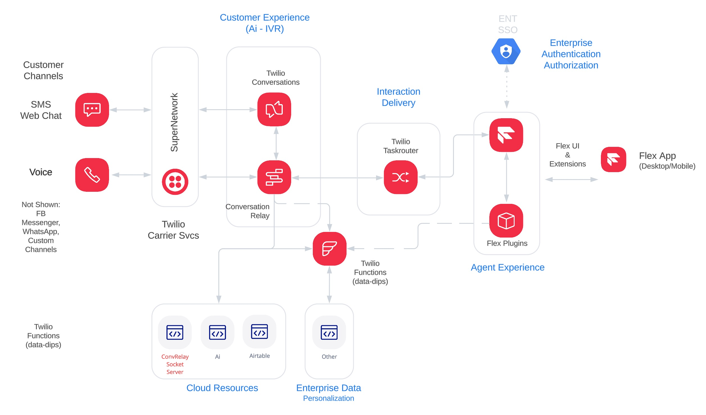
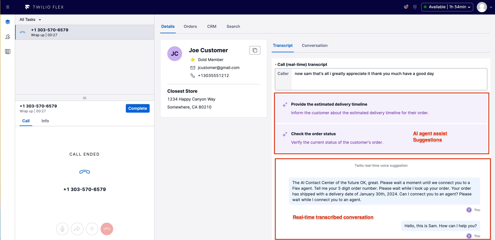

# SKO 2025 Conversation Relay - Flex Sample Plugin

>IMPORTANT:  This Flex Plugin repository contains additional functionality that illustrates real-time voice transcription.  For the SKO 2025 Hack-a-thon exercise, the transcription "features" are not implemented.  To review the documentation for details on transcription, refer to the [README-SKO2024](./README-SKO2024.md).

Follow these simple instructions to build the plugin dependencies and run locally.

The following elements and their file/folder location (parathensis), are part of this demonstration:

1. Flex Plugin (src) - Custom UI interface that summarized the Customer data and more.

2. Serverless Package (serverless) - This serverless package is OPTIONAL contains a single Twilio Function that is called by the Flex Plugin
3. Real-Time Transcription App - This is a node package is OPTIONAL and interacts with the Twilio Media Stream, Microsoft Speech Service and Twilio Sync Stream.

### Demonstration Architecture

The following image hightlight the architecture of this demonstation and the components above.



### Screenshots - Transcription and AI Suggestions

This screenshots below illustrate the agent experience of the sample plugin.  There are several "tab views" that can be customized by the SE team. 



## Setup

The following steps are necessary to use this plugin package.  These are:

1.  Flex Plugin (src) - Setup & Configure


### Flex Plugin - Setup and Configure

The following steps are necessary to configure and test the Flex Plugin found in `/src`.

1. Configure .env file
```sh
cp .env.example .env
```

2. Copy public/appConfig.example.js to appConfig.js, set your Flex accountSid within 'appConfig.js'

```sh
cp appConfig.example.js appConfig.js
```

3. Swich to the `src` directory: `cd /src`

4. Build the package dependencies.

```sh
npm i
```

5. Install necessary pre-requisites ( [Twilio CLI](https://www.twilio.com/docs/twilio-cli/getting-started/install), [Flex Plugins CLI](https://www.twilio.com/docs/flex/developer/plugins/cli) & [Twilio Serverless Toolkit](https://www.twilio.com/docs/labs/serverless-toolkit) )

6. From the CLI, Create a Twilio [account profile](https://www.twilio.com/docs/twilio-cli/general-usage/profiles) and mark it [active](https://www.twilio.com/docs/twilio-cli/general-usage/profiles#set-an-active-profile)


7. Launch the Flex Plugin

While logged into the Twilio Flex account via Twilio Console, launch the Flex Plugin on port 3001.

```sh
twilio flex:plugins:start
```
