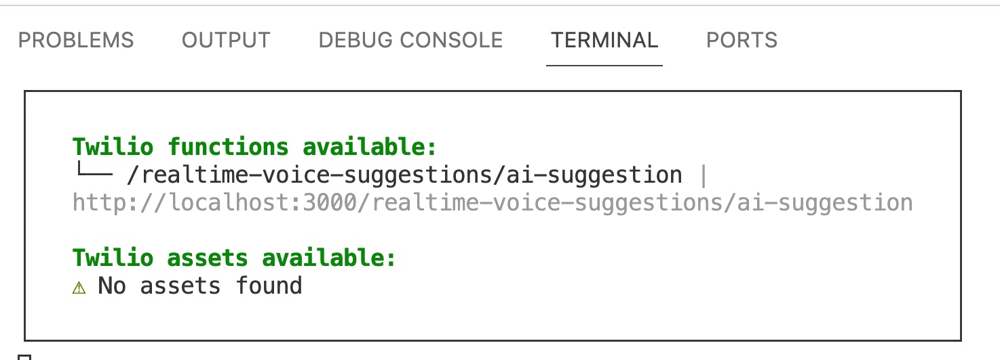

# Twilio Serverless Package: Real-time Transcription

Use this package locally ( or deploy via Twlio CLI ) to work with Flex real-time voice transcription plugin.

### Prerequisites

1. Install [Twilio CLI](https://www.twilio.com/docs/twilio-cli/getting-started/install)
2. Install CLI [Serverless Toolkit](https://www.twilio.com/docs/labs/serverless-toolkit/getting-started)
3. Create a CLI [account profile](https://www.twilio.com/docs/twilio-cli/general-usage/profiles)
4. Set the CLI account profile (Step 3) as [active](https://www.twilio.com/docs/twilio-cli/general-usage/profiles#set-an-active-profile)

### Setup and Configuration

Follow these steps to configure and test locally

### Configure Environment (.env)

Make a copy of the example .env ( .env.example ) file

```sh
cd apps/serverless
mkcopy .env.example .env
```

### Build package dependencies

```sh
npm i
```

### Start Serverless package locally

Using Visual Studio Code, open a new terminal window and start the serverless package locally.
By default this will load on port 3000

```sh
cd serverless
twilio serverless:start
```
Screenshot


### Deploy to Twilio Cloud
Follow the Twilio Serverless Toolkit docs to deploy this Twilio Serverless package to your
Twilio Account. 