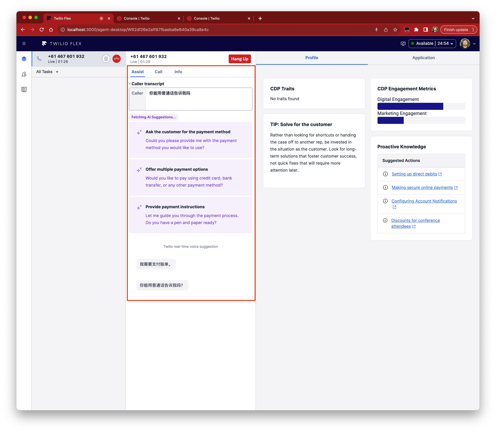

# Media Streamer

This is a Media Stream WSS server to Google/Microsoft speech server. The purpose is to enable Twilio Media Streams (multichannel inbound / outbound) to stream audio to the appropriate backend. Text that is captured is then streamed to Twilio Sync for further processing (e.g. Flex Plugin).

Special thanks to Chris Connolly for the original work [twilio-stream-transcript](https://github.com/chaosloth/twilio-stream-transcript) on this package.

## Getting Started
Ensure that you have the appropriate keys from Google/Microsoft for the respective backends. Configure these in the .env file


## Example


### Running Locally 
Follow these basic steps to get the Media Stream Transcription Engine running.

#### Configure Environment Variables
The following variables are required:

1. MS_SPEECH_KEY
2. MS_SPEECH_REGION

Twilio ENV Variables
1. TWILIO_ACCOUNT_SID
2. TWILIO_API_KEY
3. TWILIO_API_SECRET
4. TWILIO_SYNC_SERVICE_SID ( use default service for Flex )

#### Build package dependencies

```sh
npm i
```
#### Run Express Server ( port 8080 )

```sh
cd src
node index.js
```

#### Run ngrok on Localhost

```sh
./ngrok http --subdomain=<your subdomain> 8080
```

### Deploying to Google Cloud
1. Install the Google [Cloud CLI](https://cloud.google.com/sdk/docs/install)
```sh
$ gcloud init
```
2. gcloud run deploy twilio-media-receiver --source .
3. Set the environment variables (from .env)

#### Alternative
1. gcloud builds submit --pack image=[IMAGE]
2. gcloud run deploy twilio-media-receiver --image [IMAGE]


### Azure Speech Services (Recommended)
Steps to get MS Keys (See Node Tutorial:  https://www.npmjs.com/package/microsoft-cognitiveservices-speech-sdk )
1. Signup for a free Azure Subscription: https://azure.microsoft.com/en-us/free/ai-services/
2. Select a Speech Region: https://learn.microsoft.com/en-us/azure/ai-services/speech-service/regions


### Resources
The following resources are valuable.

MS Speech SDK: https://www.npmjs.com/package/microsoft-cognitiveservices-speech-sdk
Speech SKD GitHub: https://github.com/Microsoft/cognitive-services-speech-sdk-js


